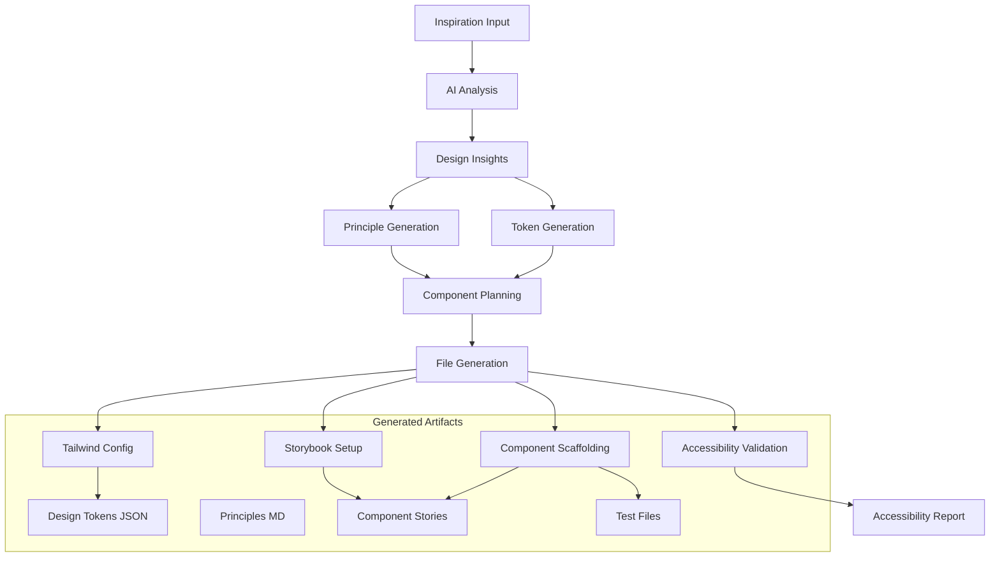

# SuperComponents - AI-Powered Design System Generator

[](https://github.com/SuperComponents/SuperComponents) [](https://github.com/SuperComponents/SuperComponents) [](https://www.typescriptlang.org/)

Transform any inspiration into a complete, production-ready React + Storybook + Tailwind v4 design system with a single command.

## 🎉 MVP Status: COMPLETE

✅ **Full CLI Implementation** - Complete command-line interface with all flags  
✅ **W3C Design Tokens** - Standards-compliant design tokens with `$type` and `$value` keys  
✅ **Tailwind v4 Configuration** - Root-level tailwind.config.ts generation  
✅ **Component Scaffolding** - Automatic React component structure generation  
✅ **WCAG Compliance** - Accessibility validation with detailed reporting  
✅ **Storybook Integration** - Complete story generation and documentation  
✅ **MCP Server** - Advanced workflow tools for component development  

## 🚀 Quick Start

```bash
# Install dependencies
npm install

# Generate a design system from inspiration
npm run generate --image https://example.com/inspiration.jpg

# Start Storybook to view your design system
npm run storybook
```

## 📦 Installation

```bash
npm install -g supercomp-mcp-server

# Or run directly with npx
npx inspiration-to-system --image <url>
```

## 🔧 CLI Usage

### Basic Command

```bash
npx inspiration-to-system [options]
```

### Input Sources (choose one)

| Flag | Description | Example |
|------|-------------|---------|
| `--image <url>` | Image URL for visual inspiration | `--image "https://dribbble.com/shots/example.jpg"` |
| `--url <url>` | Website URL for design inspiration | `--url "https://stripe.com"` |
| `--description <text>` | Text description of desired design | `--description "Modern tech startup with clean design"` |

### Context Options (optional)

| Flag | Description | Values |
|------|-------------|--------|
| `--brand <keywords>` | Brand keywords (comma-separated) | `--brand "modern, minimal, tech"` |
| `--industry <type>` | Industry type | `tech`, `finance`, `creative`, `healthcare` |
| `--audience <description>` | Target audience description | `--audience "developers and designers"` |
| `--style <preferences>` | Style preferences (comma-separated) | `modern`, `classic`, `playful`, `professional`, `minimalist` |
| `--colors <preferences>` | Color preferences (hex codes or names) | `--colors "#3b82f6,#10b981"` |
| `--accessibility <level>` | Accessibility level | `basic`, `enhanced`, `enterprise` |
| `--output <path>` | Output directory | `--output ./my-design-system` |

### Examples

#### From Image Inspiration
```bash
npx inspiration-to-system \
  --image "https://dribbble.com/shots/example.jpg" \
  --brand "modern, minimal, tech" \
  --industry "technology" \
  --audience "developers and designers" \
  --style "modern,minimal" \
  --colors "#3b82f6,#10b981" \
  --accessibility "enhanced"
```

#### From Website
```bash
npx inspiration-to-system \
  --url "https://stripe.com" \
  --brand "trustworthy, professional" \
  --industry "fintech" \
  --accessibility "enterprise"
```

#### From Description
```bash
npx inspiration-to-system \
  --description "A playful design system for a children's educational app" \
  --brand "fun, educational, colorful" \
  --audience "children ages 5-12" \
  --style "playful" \
  --colors "bright,rainbow"
```

## 📁 Generated Output Structure

```
design-system/                    # Your generated design system
├── .supercomponents/
│   └── metadata.json            # Generation metadata & config
├── design/
│   └── PRINCIPLES.md            # Design principles document
├── tokens/
│   ├── design-tokens.json       # W3C Design Tokens v1 format
│   └── accessibility-report.md  # WCAG compliance report
├── src/
│   ├── components/              # Generated React components
│   │   ├── Button/
│   │   │   ├── Button.tsx
│   │   │   ├── Button.stories.tsx
│   │   │   └── Button.test.tsx
│   │   ├── Input/
│   │   ├── Card/
│   │   └── Modal/
│   └── styles/
│       └── tokens.css           # Tailwind CSS variables
├── stories/                     # Storybook configuration
├── tailwind.config.ts          # Tailwind v4 configuration
├── package.json               # Project dependencies
├── README.md                 # Implementation guide
└── COMPONENT_PLAN.md        # Component development roadmap
```

## 🏗️ Architecture



## 🛠️ Development

### Prerequisites
- Node.js 18+
- OpenAI API key (set in `OPENAI_API_KEY` environment variable)

### Setup
```bash
# Install dependencies
npm install

# Start development server
npm run dev

# Build for production
npm run build
```

### Available Scripts

| Command | Description |
|---------|-------------|
| `npm run dev` | Run TypeScript server with hot reloading |
| `npm run build` | Compile TypeScript to JavaScript in dist/ |
| `npm start` | Run compiled production server from dist/ |
| `npm run lint` | Run ESLint on all TypeScript files |
| `npm run typecheck` | Type check without emitting files |
| `npm test` | Run Vitest tests |
| `npm run generate` | Run CLI generation tool |
| `npm run storybook` | Start Storybook development server |
| `npm run build-storybook` | Build Storybook for production |

### Testing

```bash
# Run all tests
npm test

# Run tests with coverage
npm run test:coverage

# Run tests in watch mode (default for vitest)
npm test
```

## 🔍 Workflow Details

### 1. AI Analysis
- Uses GPT-4 Vision for image analysis
- Extracts color palettes, typography, spacing, and UI patterns
- Generates design insights and rationale

### 2. Token Generation
- Creates W3C Design Tokens v1 compliant JSON
- Generates Tailwind v4 configuration
- Validates WCAG contrast ratios (≥90% pass rate required)

### 3. Principle Generation
- Infers design principles from visual analysis
- Incorporates user-provided brand keywords
- Creates structured markdown documentation

### 4. Component Planning
- Plans atomic component library structure
- Prioritizes essential components (Button, Input, Card, Modal)
- Creates implementation roadmap

### 5. File Generation
- Scaffolds complete React + TypeScript project
- Generates Storybook stories with interaction tests
- Creates comprehensive test suites

## 🎨 Design System Features

### Generated Components
- **Button**: Primary, secondary, and tertiary variants
- **Input**: Text, email, password, and textarea inputs
- **Card**: Content containers with headers and actions
- **Modal**: Overlays for dialogs and confirmations

### Accessibility
- WCAG 2.1 AA compliance validation
- Semantic HTML structure
- Keyboard navigation support
- Screen reader optimization

### Storybook Integration
- Foundation pages for tokens and principles
- Interactive component documentation
- Accessibility testing addon
- Visual regression testing

## 🤝 Contributing / Branch Strategy

We use a structured branching strategy to maintain code quality:

1. **Main Branch**: `master` - Production-ready code only
2. **Feature Branches**: Create from `master` for new features
   - Format: `feature/mvp-finish` or `feature/description`
   - Short-lived branches merged via PR
3. **Sub-branches**: For complex features, create sub-branches
   - Format: `feature/mvp-finish/subtask`
   - Merge back to parent feature branch

### Workflow
1. Create feature branch off `master`
2. Work in small, logical commits
3. Open PR to `master` when ready
4. Ensure CI passes (lint, test, build)
5. Request human review before merging

### Pull Request Requirements
- ✅ All tests pass
- ✅ Linting passes
- ✅ Type checking passes
- ✅ Build succeeds
- ✅ Accessibility validation passes
- ✅ Documentation updated

## 📋 Requirements

- Node.js 18+
- OpenAI API key for AI analysis
- Internet connection for inspiration processing

## 🔧 Configuration

### Environment Variables
```bash
# Required for AI analysis
OPENAI_API_KEY=sk-...

# Optional: Custom model configuration
OPENAI_MODEL=gpt-4-vision-preview
```

### MCP Server Usage
Add to Claude Desktop config:
```json
{
  "mcpServers": {
    "supercomp-design-system": {
      "command": "node",
      "args": ["/path/to/supercomp-mcp-server/dist/index.js"],
      "env": {
        "OPENAI_API_KEY": "sk-..."
      }
    }
  }
}
```

## 🐛 Troubleshooting

### Common Issues

**"LLM service not configured"**
```bash
export OPENAI_API_KEY="sk-..."
```

**"No inspiration provided"**
```bash
# Provide at least one input source
npx inspiration-to-system --image "https://example.com/image.jpg"
```

**"Failed to generate design system"**
- Check internet connection
- Verify API key is valid
- Ensure image URL is accessible

**"Accessibility validation failed"**
- Generated tokens don't meet WCAG AA standards
- Review color contrast ratios
- Adjust color palette for better accessibility

## 📚 Documentation

- [API Reference](docs/api.md)
- [Contributing Guide](docs/contributing.md)
- [Troubleshooting](docs/troubleshooting.md)

## 📄 License

MIT License - see [LICENSE](LICENSE) for details.

## 🙏 Acknowledgments

Built with:
- [React](https://reactjs.org/) - UI framework
- [Storybook](https://storybook.js.org/) - Component documentation
- [Tailwind CSS v4](https://tailwindcss.com/) - Styling system
- [TypeScript](https://www.typescriptlang.org/) - Type safety
- [Vitest](https://vitest.dev/) - Testing framework
- [OpenAI](https://openai.com/) - AI analysis
