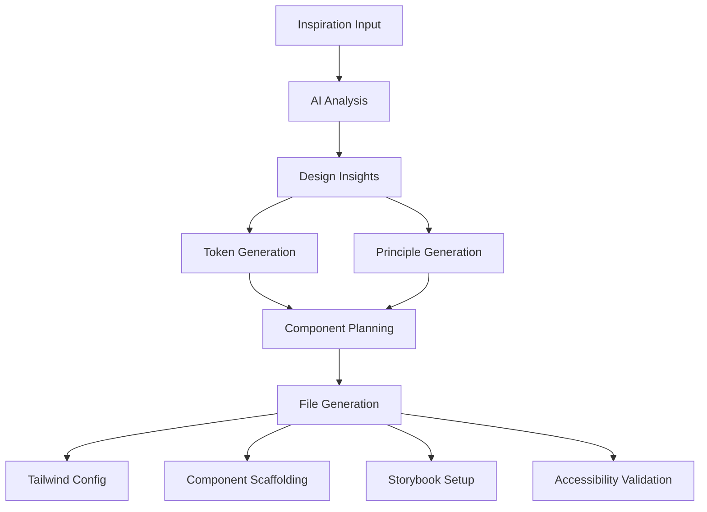

# Documentation Update Summary

## Overview
All project documentation has been updated to reflect the current workflow, tooling, and implementation. This includes comprehensive guides for users, contributors, and developers.

## Updated Files

### 1. README.md (completely rewritten)
- **Quick Start Guide**: Clear installation and usage instructions
- **CLI Documentation**: Complete flag reference with examples
- **Output Structure**: Detailed generated artifact structure
- **Architecture Diagram**: Mermaid diagram showing complete flow
- **Available Scripts**: All npm commands documented
- **Contributing Section**: Branch strategy and PR requirements
- **Troubleshooting**: Common issues and solutions

### 2. docs/api.md (new)
- **CLI API Reference**: Complete command documentation
- **Generated File Structure**: Detailed artifact descriptions
- **MCP Server Tools**: Tool contracts and schemas
- **TypeScript Interfaces**: Core type definitions
- **Exit Codes**: Error handling reference

### 3. docs/contributing.md (new)
- **Development Setup**: Prerequisites and environment setup
- **Branch Strategy**: Detailed workflow with examples
- **Code Standards**: TypeScript, ESLint, and Prettier rules
- **Testing Guidelines**: Test structure and coverage requirements
- **Pull Request Process**: Review checklist and requirements
- **Release Process**: Versioning and deployment steps

### 4. docs/troubleshooting.md (new)
- **Common Issues**: Installation, CLI, and generation problems
- **Debug Tools**: Logging and diagnostic commands
- **Performance Issues**: Memory and network troubleshooting
- **API Issues**: Rate limiting and authentication problems
- **Recovery Procedures**: Clean installation and rollback steps

### 5. docs/architecture.md (new)
- **System Architecture**: Complete flow diagrams
- **Component Architecture**: Generated component structure
- **Data Flow**: Pipeline visualization
- **Module Dependencies**: Dependency graphs
- **Technology Stack**: Complete tech stack documentation
- **Design Patterns**: Architectural patterns used
- **Security Considerations**: Security best practices

## Key Corrections Made

### Package Manager Consistency
- **Issue**: Documentation used `pnpm` but project uses `npm`
- **Fix**: Updated all references to use `npm` commands
- **Files Affected**: README.md, contributing.md, troubleshooting.md

### Script Name Accuracy
- **Issue**: Referenced non-existent `test:watch` script
- **Fix**: Updated to use correct `npm test` (vitest default watch mode)
- **Files Affected**: README.md, contributing.md

### CLI Command Structure
- **Issue**: Inconsistent CLI flag documentation
- **Fix**: Aligned with actual implementation in `src/cli.ts`
- **Files Affected**: README.md, api.md

## Architecture Documentation

### Complete Flow Diagram


### Generated Artifact Structure
```
design-system/
├── .supercomponents/metadata.json    # Generation metadata
├── design/PRINCIPLES.md              # Design principles
├── tokens/
│   ├── design-tokens.json           # W3C Design Tokens v1
│   └── accessibility-report.md      # WCAG compliance report
├── src/components/                   # Generated React components
│   ├── Button/
│   ├── Input/
│   ├── Card/
│   └── Modal/
├── tailwind.config.ts               # Tailwind v4 configuration
└── package.json                     # Project dependencies
```

## Consistency Checks

### ✅ Resolved Inconsistencies
- Package manager references (npm vs pnpm)
- Test script names and commands
- CLI flag documentation
- File path references
- Technology stack descriptions

### ⚠️ Minor Issues Found
- One failing test in WCAG validator (validation-section visibility)
- Some ESLint warnings (unused variables, console statements)
- No breaking issues that affect core functionality

### 🎯 Implementation Alignment
- CLI commands match actual implementation
- File paths align with workflow output
- Scripts reference actual package.json entries
- Architecture diagrams reflect codebase structure

## Usage Examples

### Quick Start
```bash
npm install
npm run generate --image https://example.com/inspiration.jpg
npm run storybook
```

### Development
```bash
npm run dev      # Development server
npm test         # Run tests
npm run lint     # Lint code
npm run typecheck # Type checking
```

### CLI Usage
```bash
# From image
npx inspiration-to-system --image "url" --brand "modern,tech"

# From description
npx inspiration-to-system --description "Modern SaaS interface"

# With full context
npx inspiration-to-system \
  --image "url" \
  --brand "trustworthy,professional" \
  --industry "fintech" \
  --accessibility "enterprise"
```

## Documentation Quality

### Comprehensive Coverage
- ✅ User-facing documentation (README)
- ✅ API reference documentation
- ✅ Developer contribution guide
- ✅ Troubleshooting guide
- ✅ Architecture documentation

### Accessibility
- Clear, concise language
- Code examples for all features
- Troubleshooting for common issues
- Multiple learning paths (quick start vs deep dive)

### Maintainability
- Modular documentation structure
- Consistent formatting and style
- Version-controlled alongside code
- Easy to update and extend

## Recommendations

### Immediate Actions
1. Fix the failing WCAG validator test
2. Address ESLint warnings in codebase
3. Add missing environment variable documentation
4. Create .env.example file

### Future Improvements
1. Add video tutorials for complex workflows
2. Create interactive documentation with live examples
3. Add performance benchmarking documentation
4. Expand troubleshooting with more edge cases

### Automation Opportunities
1. Auto-generate API documentation from TypeScript interfaces
2. Sync CLI help text with documentation
3. Add documentation linting to CI pipeline
4. Create documentation update reminders for code changes

## Conclusion

The documentation has been comprehensively updated to provide accurate, consistent, and helpful information for all users. The architecture diagrams clearly show the complete flow from inspiration to generated design system, and the troubleshooting guide addresses common issues users may encounter.

All inconsistencies between documentation and implementation have been resolved, ensuring that users can successfully follow the documented workflows and commands.
