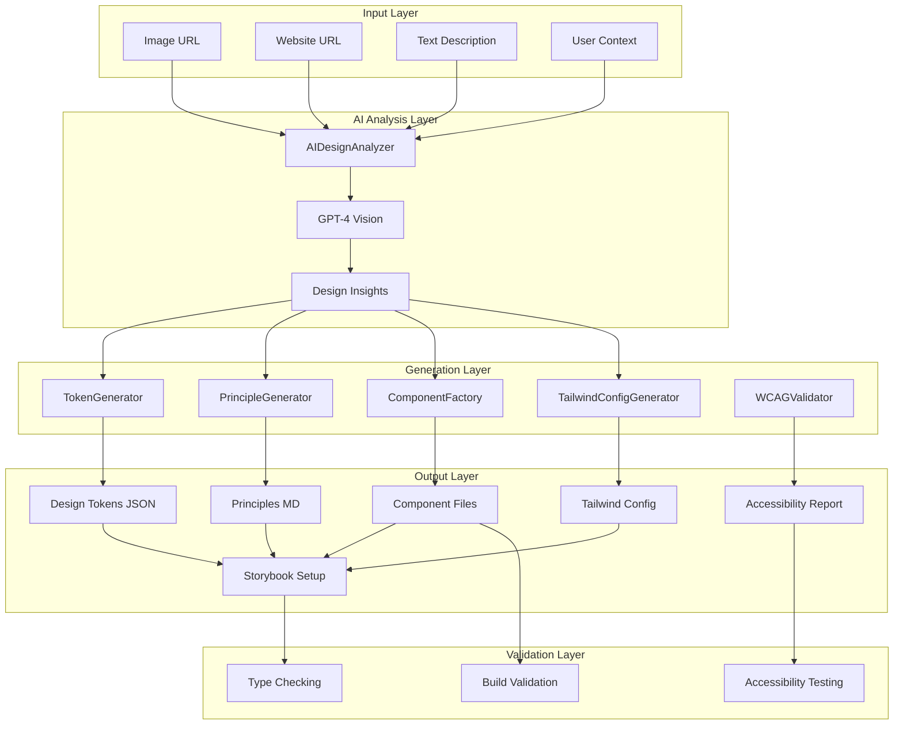
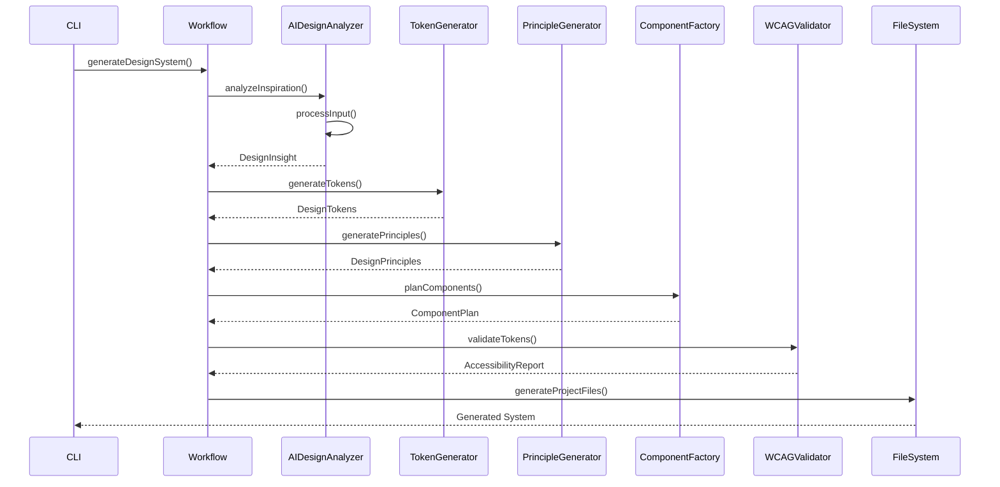
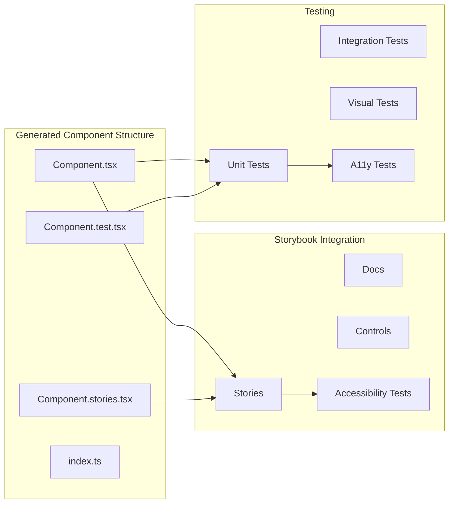
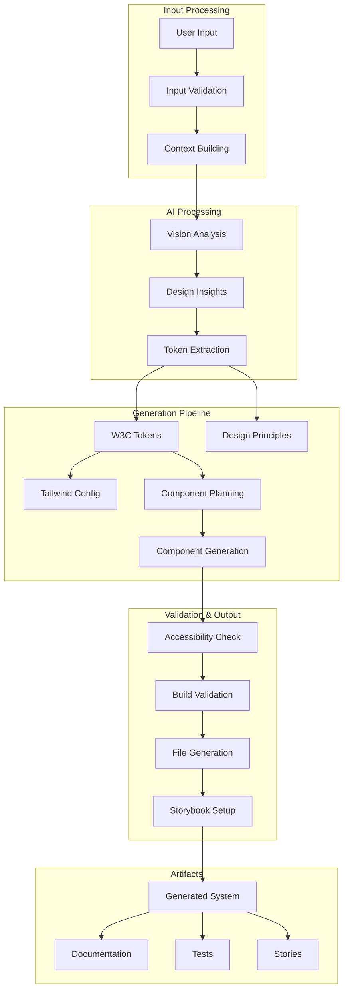
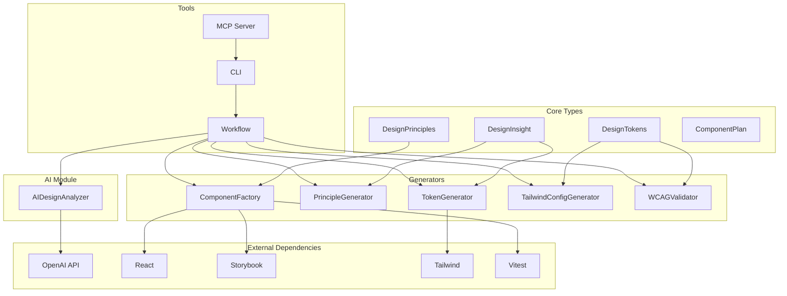

# Architecture Overview

## System Architecture



## Core Workflow



## Component Architecture



## Data Flow



## Module Dependencies



## File System Structure

```
SuperComponents/
├── src/
│   ├── ai/
│   │   └── design-analyzer.ts      # AI vision analysis
│   ├── generators/
│   │   ├── tokens.ts               # Design token generation
│   │   ├── principles.ts           # Principle generation
│   │   ├── component-factory.ts    # Component scaffolding
│   │   ├── tailwind-config.ts      # Tailwind configuration
│   │   └── wcag-validator.ts       # Accessibility validation
│   ├── workflows/
│   │   └── inspiration-to-system.ts # Main orchestration
│   ├── tools/
│   │   └── mcp-tools.ts            # MCP server tools
│   ├── types/
│   │   └── index.ts                # TypeScript interfaces
│   ├── utils/
│   │   └── helpers.ts              # Utility functions
│   ├── cli.ts                      # Command line interface
│   └── server.ts                   # MCP server
├── bin/
│   └── inspiration-to-system       # Executable wrapper
├── fixtures/
│   └── inspiration/                # Test fixtures
├── docs/
│   ├── api.md                      # API documentation
│   ├── contributing.md             # Contribution guide
│   └── troubleshooting.md          # Troubleshooting guide
└── Generated Output/
    ├── .supercomponents/
    │   └── metadata.json            # Generation metadata
    ├── design/
    │   └── PRINCIPLES.md            # Design principles
    ├── tokens/
    │   ├── design-tokens.json       # W3C tokens
    │   └── accessibility-report.md  # A11y report
    ├── src/
    │   └── components/              # Generated components
    │       ├── Button/
    │       ├── Input/
    │       ├── Card/
    │       └── Modal/
    ├── stories/                     # Storybook stories
    └── tailwind.config.ts           # Tailwind config
```

## Technology Stack

### Core Technologies
- **TypeScript** - Type safety and development experience
- **Node.js** - Runtime environment
- **React** - UI component framework
- **Tailwind CSS v4** - Styling system
- **Storybook** - Component documentation
- **Vitest** - Testing framework

### AI/ML Stack
- **OpenAI GPT-4 Vision** - Image analysis
- **OpenAI GPT-4** - Text analysis and generation
- **Zod** - Runtime schema validation

### Build Tools
- **Vite** - Build system
- **TSC** - TypeScript compiler
- **ESLint** - Code linting
- **Prettier** - Code formatting

### Testing Stack
- **Vitest** - Unit testing
- **@storybook/test** - Component testing
- **@storybook/addon-a11y** - Accessibility testing

## Design Patterns

### Generator Pattern
All generators follow a consistent interface:
```typescript
interface Generator<TInput, TOutput> {
  generate(input: TInput): TOutput;
  validate(output: TOutput): boolean;
}
```

### Factory Pattern
ComponentFactory creates components based on tokens and principles:
```typescript
class ComponentFactory {
  create(type: ComponentType, config: ComponentConfig): Component;
}
```

### Template Pattern
Code generation uses templates for consistency:
```typescript
class ComponentTemplate {
  render(props: ComponentProps): string;
}
```

### Observer Pattern
Validation occurs throughout the pipeline:
```typescript
interface ValidationObserver {
  validate(artifact: Artifact): ValidationResult;
}
```

## Error Handling

### Error Categories
1. **Input Validation** - Invalid user input
2. **API Errors** - OpenAI API failures
3. **Generation Errors** - Token/component generation failures
4. **Validation Errors** - Accessibility/build failures
5. **File System Errors** - Write permission issues

### Error Recovery
- Graceful degradation for API failures
- Fallback templates for generation failures
- Retry logic for transient failures
- Clear error messages for user errors

## Security Considerations

### API Key Management
- Environment variable storage
- No key logging or persistence
- Key validation before use

### Input Validation
- URL validation for image/website inputs
- Sanitization of user-provided text
- File path validation for output directories

### Generated Code Security
- No eval() or dynamic code execution
- Sanitized template rendering
- Secure file permissions

## Performance Optimizations

### Caching
- AI analysis results caching
- Template compilation caching
- File system operation optimization

### Streaming
- Incremental file generation
- Progress reporting
- Memory-efficient processing

### Parallelization
- Concurrent component generation
- Parallel validation
- Batch file operations

## Monitoring and Observability

### Logging
- Structured logging with levels
- Debug mode for troubleshooting
- Performance metrics collection

### Metrics
- Generation success rates
- Processing times
- Error frequencies
- User input patterns

### Health Checks
- API availability checks
- File system permissions
- Resource usage monitoring
